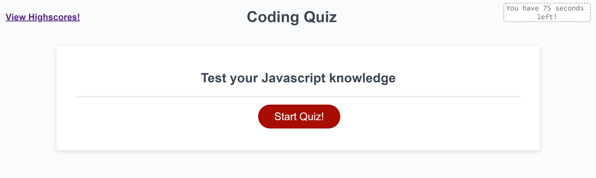

# Coding Quiz Challenge

## Purpose
Used to test a person's basic Javascript knowledge. The user starts with 75 seconds of time and five seconds are deducted for every incorrect answer. The user must get through the entire quiz and get a score (seconds remaining) in the top three in order to save their score to the highscore leaderboard.

## Website
The actual website can be viewed at the [following link](https://aelisker.github.io/coding-quiz/). The code repository can be found at [here](https://github.com/aelisker/coding-quiz).

You can also find a screenshot of the website below:

